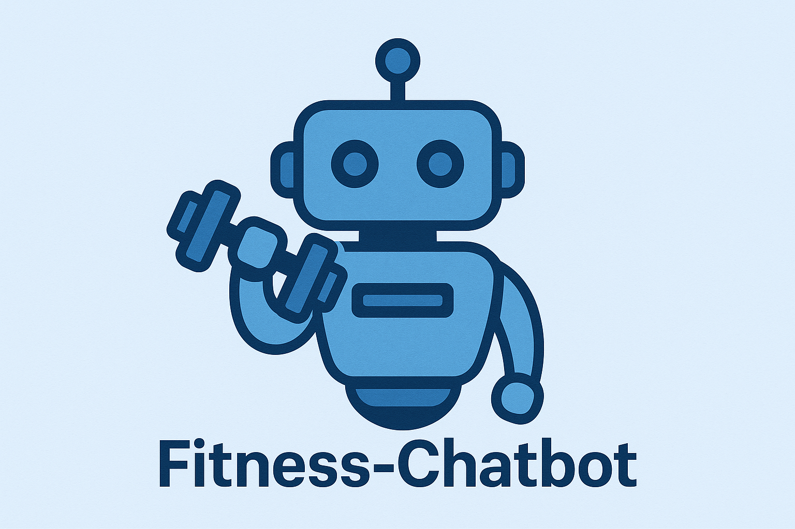

# Fitness‑Chatbot

A fitness planning chatbot designed to assist users in creating, evaluating, and managing personalized workout routines.
Fitness-Chatbot is an intelligent conversational agent designed to help users plan, track, and refine personalized workout routines. By leveraging LLMs, it can interact naturally, assess progress, and adapt workout plans over time.

---

## Features

- Allows users to interactively create customized fitness plans.
- Tracks user progress.
- Built with modular components for easy extension.
- Evaluation capabilities via Jupyter notebooks to assess performance (`eval.ipynb`, `rag_eval.ipynb`).

---

## Requirements

- Python 3.9+  
- Required packages listed in `requirements.txt`, which may include Flask, transformers, langchain, and others for NLP and chatbot functionality.

## Setup & Installation


1. **Create and activate a virtual environment**
    ```bash
    python3 -m venv venv
    source venv/bin/activate   
    ```

2. **Install dependencies**
    ```bash
    pip install -r requirements.txt
    ```

## Configuration

    Here are the required API keys:
    - Tavily 
    - Google API key
    - LLAMA cloud API key 

## Usage

1. **Run Flask application**
    ```bash 
    python app.py
    ```
2. **Run Chatbot**
    ```bash
    chainlit run chatbot.py
    ```


